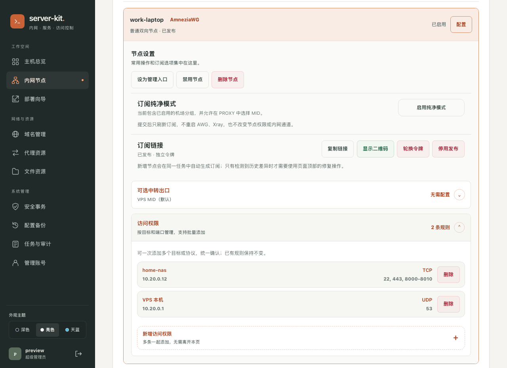
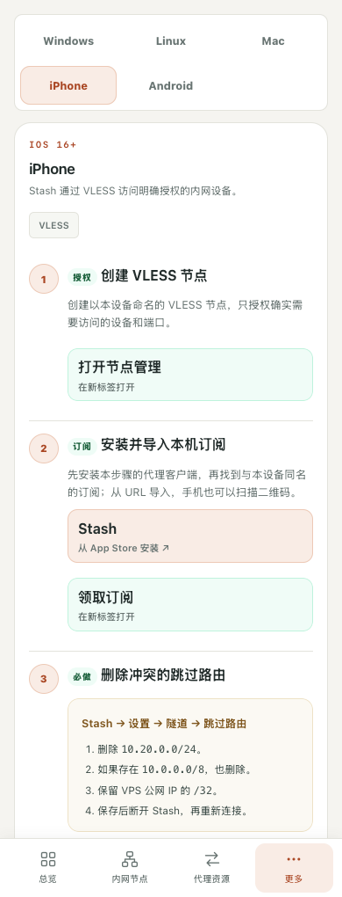

# server-kit

**Connect your private network. Manage it in one place.** Use a Debian VPS to connect your computers and servers, then manage devices, access rules, and services in a private web dashboard.

[简体中文](README.md) · [Easy English](README.en.md)



*Screenshots use local demo data, not real devices or credentials. The dashboard and CLI currently use Chinese.*

## What it does

- **Private network:** AWG devices can connect both ways. Set access by target, TCP / UDP, and port range. Add several rules at once.
- **Phone access:** VLESS devices can reach allowed private services in one direction. New VLESS devices have no private access by default.
- **One dashboard:** setup guides, subscriptions, proxy resources, dynamic DNS, task logs, and encrypted backups.

After their first handshake is confirmed, AWG devices can access the whole private network by default. To restrict them, add needed rules first, then remove the “all” rule. **Basic private networking needs no upstream subscription or extra proxy exit.**

## Quick start

### 1. Prepare your VPS

Use **Debian 12 / 13 · amd64 · systemd · root access**, with a kernel that can build and load AmneziaWG. A fresh VPS is recommended. Keep your current SSH session and your provider's recovery console available.

Allow these ports in the cloud firewall and any existing host firewall:

| Port | Purpose |
| --- | --- |
| Your current SSH TCP port | Setup and recovery |
| Main AWG UDP port, default `443` | Private network |
| Backup UDP port shown during setup | Backup connection |

**Do not expose dashboard port `9080` to the Internet.** Use the actual ports printed by setup. Open other services only when needed.

### 2. Install the dashboard

Run on the **VPS in an interactive root terminal**:

```bash
apt-get update
apt-get install -y git ca-certificates python3
git clone https://github.com/je00/server-kit.git /root/server-kit
cd /root/server-kit
bash install-server-kit.sh install
server-kit preflight
server-kit init
```

Follow the prompts for the admin name, password, and dashboard port. Setup installs AWG if needed. It does not install all optional services, change SSH, or apply the host input firewall policy. AWG does set up its own forwarding and network rules.

If setup asks for a kernel reboot, check recovery access first. Reboot as instructed, then run `cd /root/server-kit && bash ./server-kit init`.

### 3. First login: use an SSH tunnel

Open a **new terminal on your own computer**. Replace `SSH_PORT` and `YOUR_VPS_IP`:

```bash
ssh -N -o ExitOnForwardFailure=yes -L 127.0.0.1:9080:10.20.0.1:9080 -p SSH_PORT root@YOUR_VPS_IP
```

No terminal output is normal. Leave it running, open **http://127.0.0.1:9080**, and sign in. If setup printed a different private address or port, use those values.

### 4. Connect your first device

1. Have an **AmneziaWG-compatible** client ready on your device. Open **内网节点 → 新增节点** (Network nodes → Add node) and create a regular AWG node.
2. Save or scan the browser-generated configuration before registration. Save both main and backup profiles, but turn on only one. The VPS does not keep your client private key and cannot recover it.
3. **Preview and confirm registration, then connect within 5 minutes** to complete the first handshake. If it times out, the node is removed and must be registered again.
4. Wait for **已启用** (Enabled), then select **设为管理入口** (Set as management entry). Check that **http://10.20.0.1:9080** opens directly over AWG before closing the SSH tunnel.

Your basic private network is ready. Use **部署向导** (Setup guide) for more devices. Each device's own firewall must also allow the services you want to reach.

<details>
<summary>Mobile view — demo data</summary>

<p></p>

</details>

## Add features when needed

| Need | Where to go |
| --- | --- |
| VLESS, Clash subscriptions, files, Mosh | **部署向导** (Setup guide); first-time Clash setup needs VLESS REALITY, an upstream URL, and an exit configuration |
| Recover after a VPS IP change | **域名管理** (Domains): stable hostname + DNSPod / DuckDNS; [recovery guide](docs/public-ip-change-runbook.md) |
| Resolve business domains through a selected exit | [Exit-consistent DNS](docs/operations.md#出口一致-dns); third-party IP location labels may still differ |
| SSH / firewall changes and backups | **安全事务 / 配置备份** (Security / Backups); verify a second connection before confirming |

High-risk actions may be preview-only until the required [safety checks](docs/management-plane-design.md) are complete. DDNS recovery depends on network readiness and DNS caches; it is not zero-downtime. Keep your backup recovery password safe.

## Update and troubleshoot

Run the update from the **newly pulled source** on the VPS. The global command may still point to the old release:

```bash
cd /root/server-kit
git pull --ff-only
bash ./server-kit update-web
```

Updates briefly restart management services. If the built-in health check fails, the updater tries to restore the old code. AWG, SSH, and firewall configuration are not changed. Code rollback is not a full data restore: make a backup and keep SSH open.

```bash
server-kit status                # Dashboard status
server-kit-manager.sh status     # Managed services
server-kit-manager.sh audit      # Configuration checks
server-kit recovery              # Recovery menu over SSH / provider console
```

No dashboard? Check the SSH tunnel, address, and port. No AWG connection? Check UDP rules and client endpoints. Do not start by disabling the firewall or restarting every service.

[Operations](docs/operations.md) · [Key storage](docs/local-key-generator-privacy.md) · [Stash 3.4.1](docs/stash-3.4.md)

Do not publish client configurations, subscription URLs, keys, or backups. Documentation domains, public addresses, and screenshots are examples.
