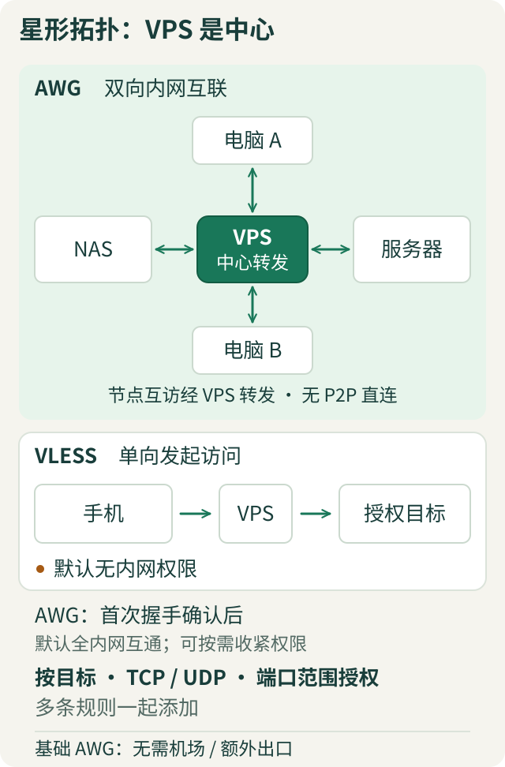
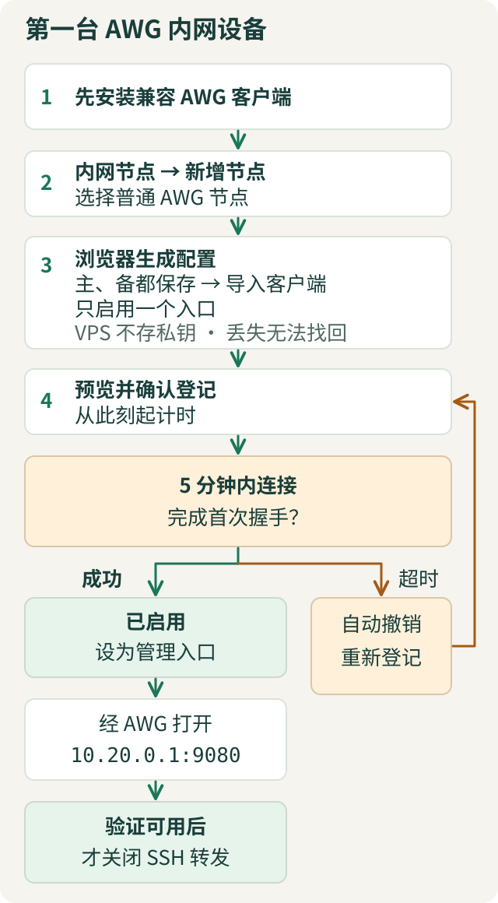

# server-kit

一台 Debian VPS，连通设备，在内网面板管理权限与服务。

[中文](README.md) · [Easy English](README.en.md) · [直接部署](#快速部署)



## 快速部署

**Debian 12/13 · amd64 · systemd · root · 可编译/加载 AmneziaWG（AWG）的内核。** 推荐新 VPS；保留当前 SSH 和救援控制台。

| 云安全组＋已有主机防火墙 | 公网入口 |
| --- | --- |
| 当前 SSH TCP 端口 | 允许 |
| AWG 主 UDP（默认 `443`）＋备用 UDP | 允许；以安装输出为准 |
| 管理面板 `9080/TCP` | 不开放；其他服务按需放行 |

### 1. VPS：安装

```bash
# 在 VPS 的 root 交互终端执行
apt-get update
apt-get install -y git ca-certificates python3
git clone https://github.com/je00/server-kit.git /root/server-kit
cd /root/server-kit
bash install-server-kit.sh install
server-kit preflight
server-kit init
```

按提示设置管理员、密码、面板端口。仅按需安装 **AWG＋面板**；不改 SSH / 主机入口策略，AWG 会配置自身转发和网络规则。

<details>
<summary>安装提示内核／头文件需要重启？先确认救援入口</summary>

按提示重启，重新 SSH 登录后执行：

```bash
cd /root/server-kit
bash ./server-kit init
```

</details>

### 2. 自己电脑：首次登录

仅在初始化成功后继续；替换 `SSH_PORT`、`YOUR_VPS_IP`。内网地址／面板端口按安装输出调整。

```bash
# 另开终端；保持运行，无输出是正常现象
ssh -N -o ExitOnForwardFailure=yes -L 127.0.0.1:9080:10.20.0.1:9080 -p SSH_PORT root@YOUR_VPS_IP
```

浏览器打开 [http://127.0.0.1:9080](http://127.0.0.1:9080)，用刚创建的账号登录。

### 3. 浏览器：内网节点 → 新增节点



验证入口：[http://10.20.0.1:9080](http://10.20.0.1:9080)。其他设备按“部署向导”接入；设备自身防火墙仍需放行目标服务。

### 4. 按需收紧权限


`访问权限 → 新增访问权限 → 再加一条 → 预览 → 确认`

**需要隔离：先添加必要权限，再撤销“全部”授权。**

## 可选功能

| 需要 | 操作／前提 |
| --- | --- |
| VLESS / Clash / 文件 / Mosh | 部署向导；首次 Clash 需 VLESS REALITY＋机场链接＋出口配置 |
| VPS 换 IP | 域名管理：稳定域名＋DNSPod / DuckDNS；[恢复步骤](docs/public-ip-change-runbook.md) |
| 业务 DNS 走指定出口 | [出口一致 DNS](docs/operations.md#出口一致-dns)；不保证第三方 IP 定位相同 |
| SSH / 防火墙 | 安全事务；高风险操作可能仅预览，按[安全设计](docs/management-plane-design.md)验收启用；第二条连接验证后才确认 |
| 加密备份 / 审计 | 配置备份／任务与审计；恢复口令单独保存 |

DDNS 受联网和 DNS 缓存影响，不承诺零中断。

<details>
<summary>手机接入示例</summary>

<p></p>

</details>

## 更新与恢复

先备份、保留 SSH；从**新拉取的源码**更新，全局命令可能仍指向旧版。

```bash
# VPS · root
cd /root/server-kit
git pull --ff-only
bash ./server-kit update-web
```

管理服务会短暂重启；不改 AWG / SSH / 防火墙配置。健康检查失败时尝试代码回退，**不等于完整数据恢复**。

```bash
server-kit status                # 面板状态
server-kit-manager.sh status     # 服务状态
server-kit-manager.sh audit      # 配置检查
server-kit recovery              # SSH / 救援控制台中的恢复菜单
```

| 故障 | 先查 |
| --- | --- |
| 面板打不开 | SSH 转发、地址、端口 |
| AWG 连不上 | UDP 放行、客户端入口；不要关闭防火墙或重启全部服务 |

[运维指南](docs/operations.md) · [密钥保管](docs/local-key-generator-privacy.md) · [Stash 3.4.1](docs/stash-3.4.md)

界面／CLI 以中文为主；图为流程示意或本地模拟数据，地址以实际配置为准。**不公开配置、订阅链接、密钥或备份。**
